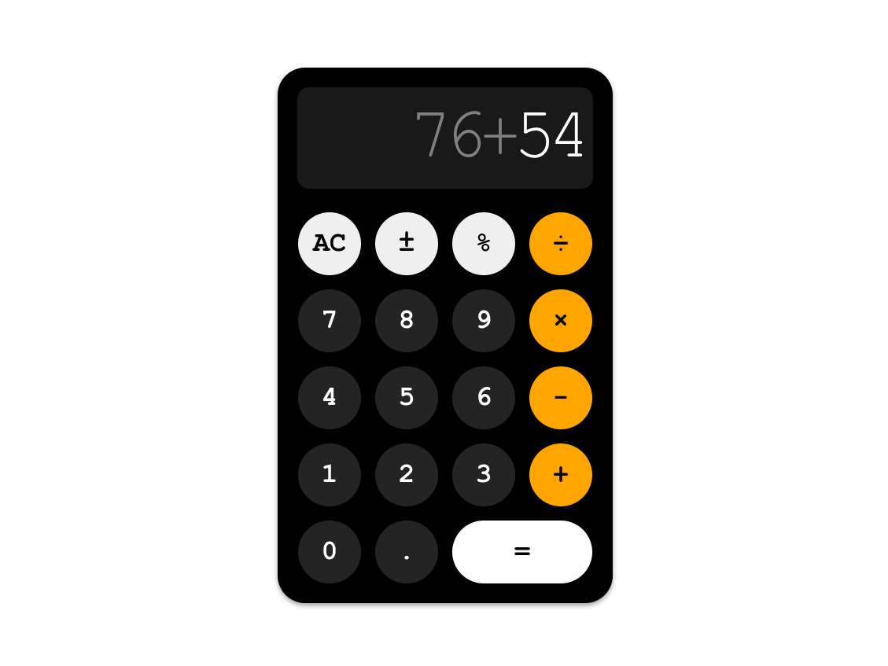

# Calculator
## Live Preview <a href="https://anaseig.github.io/calculator" target="_blank">HERE</a>

This was my last project for the <b>Foundations</b> section. So I was very excited when I was about to finish.

Turns out it was easier than I thought. Mainly because of I learned a lot in the previous <a href="https://github.com/anaseig/pixel_sketch">Pixel Sketch</a> project, and I was able to transfer what I've learned in this project.

All I needed is to push myself a bit harder to come up with a logic and of course help from the Odin Community

It took me 14 days and <b>18 hours</b> of work to finish.

